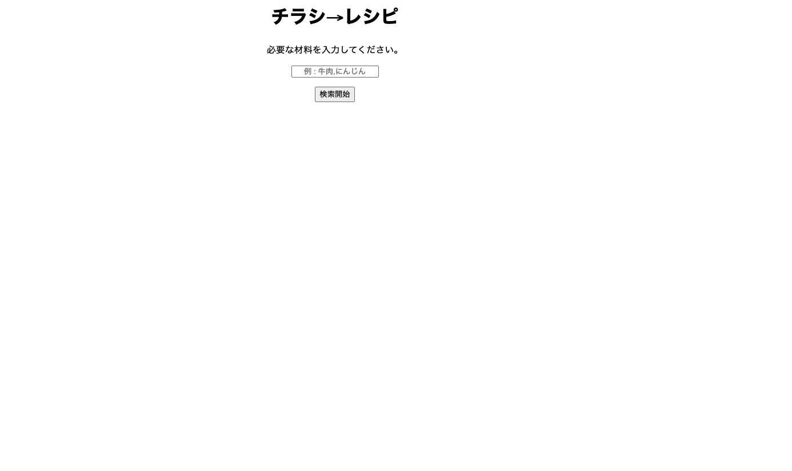
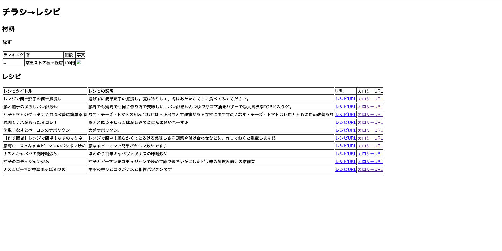
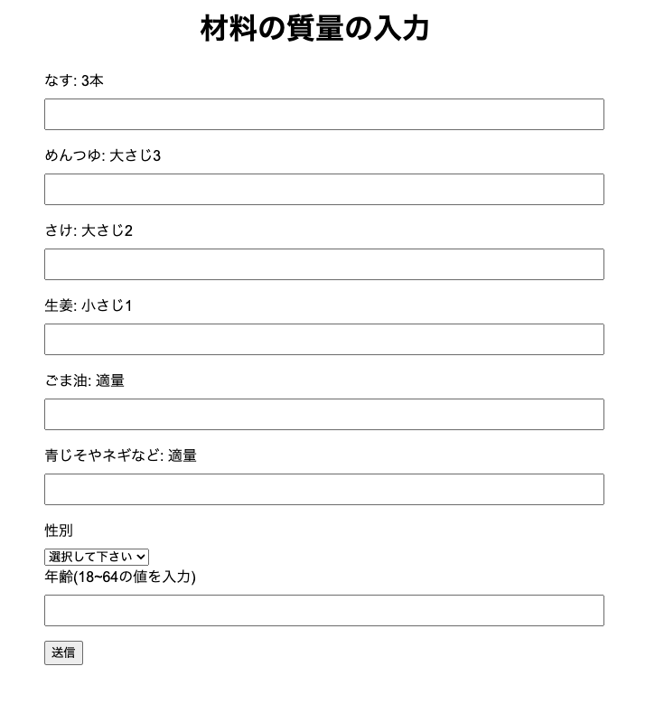
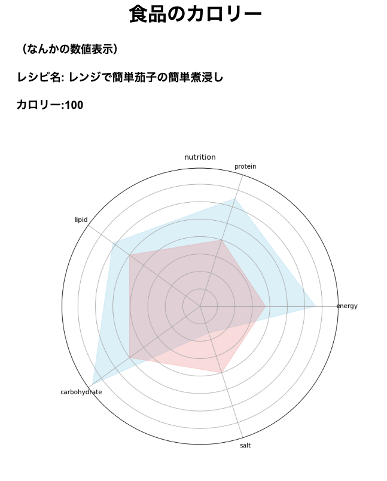

# チラシ情報による値段比較とレシピの推薦システム

チラシをOCRし、取得した文字列に対して操作をする

## 開発メンバー

[@takusandayooo](https://github.com/takusandayooo)  
[@Lang0130](https://github.com/Lang0130)  
[@suzumura0121](https://github.com/suzumura0121)  
[@issei0922](https://github.com/issei0922)  

## 機能の説明
機能は、大きく2種類に分かれています。

### 1. チラシ内の情報取得
作業フォルダーは、[`tirasi`](./tirasi)です。
#### 機能の詳細
1. チラシの入っているGoogleDriveフォルダーから写真をダンロード
2. チラシを**OpenCV**を用いて直線検出を実行
3. 情景内文字認識のデータセット[**PaddleOCR**](https://github.com/PaddlePaddle/PaddleOCR)を用いて情報取得
4. GoogleのAI Geminiを用いてOCR結果文字列に対して商品を分類分け   
   Ex:OCR結果→GeminiAI:`国産えんてつ黒毛和牛切り落とし肉`→`牛肉`
5. 店名と食品と値段のデータベースを作成

### 2. レシピ検索やカロリー計算
作業フォルダーは、[`web`](./web)です。
#### 機能の詳細
1. 入力した食材のレシピ検索(クックパッドを利用している)
2. 入力した食材をデータベースから検索しランキングを取得
3. Flaskを用いてwebサイトに食材安いライキングやレシピを表示
4. 検索したレシピのカロリーや栄養素のレーダーチャートを計算し表示

## 実行環境構築

### 1. ライブラリーのインストール
↓どれがpipinstallかわからなかったので↓
```
pip install ~~
```
### 2. GeminiAPIのAPIkeyの取得・入力
[Google AI Studio](https://cloud.google.com/generative-ai-studio?hl=ja)にアクセスし、APIkeyを取得し[`GeminiAPI.py`](./tirasi/modules/GeminiAPI.py)の`GOOGLE_API_KEY`に入力
### 3. チラシのダウンロードURLを返すAPIの設定
[GoogleAppsScript](./GoogleAppsScript/)のフォルダーにコードが書いてありフォルダーIDを設定し実行を行なってください  
[`API.gs`](./GoogleAppsScript/API.gs)は、デプロイしURLを取得しIDと一緒に[`main_get_infomations.py`](./tirasi/modules/main_get_infomations.py)に貼り付けてください

### 4. チラシの情報の取得
tirasiデレクトリに入り、[`main.py`](./tirasi/main.py)を実行する  
正常に実行が終わると、[`csv`](./web/static/csv/)に`item.csv`が作成されます  

### 5. レシピ検索・ランキング検索
webデレクトリに入り、[`root.py`](./web/root.py)を実行する  
http://127.0.0.1:5000 にアクセスしwebサイトを表示する

## webサイトの使い方
1. テキストボックスに食材名を入力し検索開始ボタンを押す  
   *食材が複数ある場合は、`,`(コンマ)で区切る
   
2. 食材欄がチラシからの値段情報によるランキング表示  
   レシピ欄は入力された食材を用いたレシピを表示  
   カロリーURLをタップすることで食材のgを入力する画面に移動する

   

3. 材料の質量の入力   
   テキストボックスにグラムを入力しその後年齢性別を入力し、送信ボタンを押す
   
4. レーダーチャートの表示(データはサンプルデータを使用しています)
   
